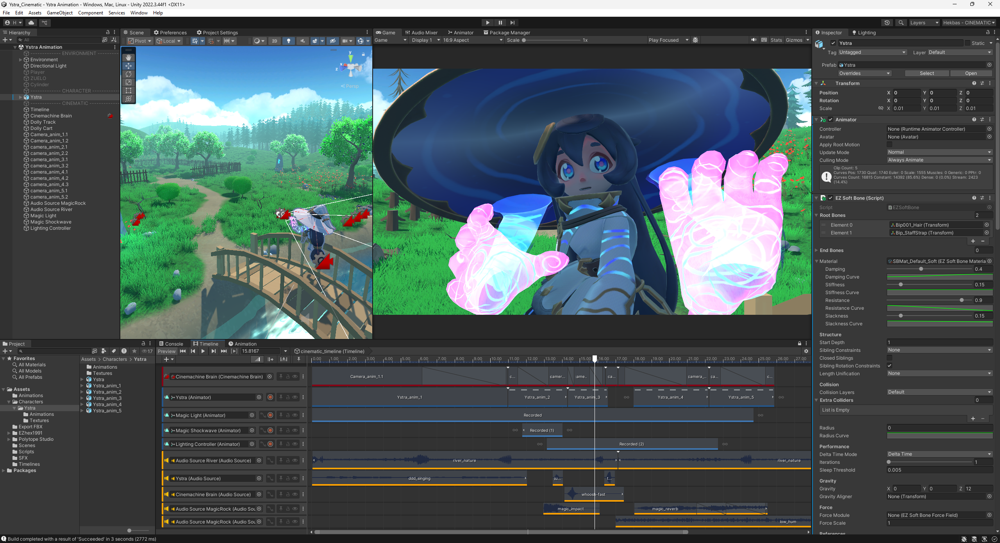

# Ystra Cinematic

This repository contains a Unity project showcasing a rigged character animation utilizing Unity's Timeline and Cinemachine tools to create a cinematic scene.

## Features

**Character Animation**, brought to life with custom animations created in Maya.

**Unity's Timeline** is used to sequence animations, control the scene lighting, and manage audio.

**Cinemachine** is used to handle dynamic camera movements and shots, ensuring a cinematic and engaging perspective.

**Scene lighting** is animated and managed through the Timeline and the use of a custom script, creating dynamic light changes synchronized with the animation.

## Scene Overview

The scene features a fantasy environment with a flowing river, a wooden bridge, and magical elements.  
The character interacts with the environment, showcasing their animations in various cinematic shots.

## Acknowledgments

**Christoph (The Stoff) Schoch**: For providing the rigged character used in this project.